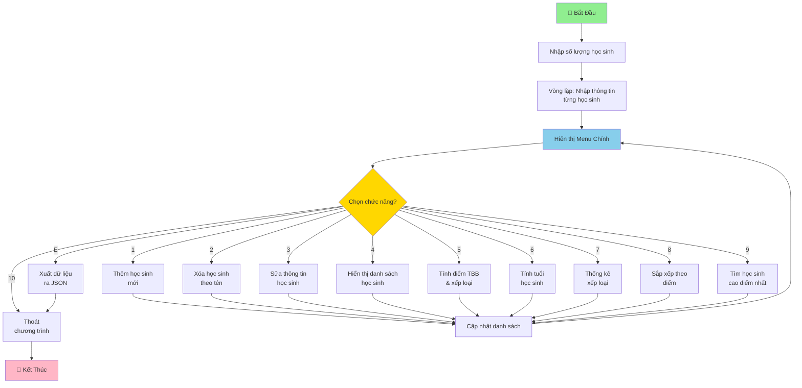

# Chương Trình Quản Lý Học Sinh

## Mô Tả Chung

Chương trình quản lý học sinh là một ứng dụng dòng lệnh giúp quản lý thông tin học sinh, điểm số và xếp loại học tập. Chương trình hỗ trợ các thao tác crudbasic và cung cấp các chức năng phân tích dữ liệu học sinh toàn diện.

---

## Flowchart Chương Trình

---

## Tính Năng Chính

### 1. Thêm Học Sinh

Cho phép thêm một học sinh mới vào danh sách. Người dùng cần nhập:
- Họ và tên (chỉ nhận ký tự chữ)
- Giới tính (Nam hoặc Nữ)
- Ngày sinh (định dạng dd/mm/yyyy)
- Điểm các môn học cho HK1 và HK2 (các môn: Toán, Lý, Hóa, Anh, Sinh, Văn, Sử)

### 2. Xóa Học Sinh

Xóa một học sinh khỏi danh sách dựa trên tên của họ. Chương trình sẽ tìm kiếm theo tên (không phân biệt hoa/thường) và xóa học sinh khỏi danh sách.

### 3. Sửa Thông Tin Học Sinh

Cho phép cập nhật thông tin của một học sinh đã có:
- Sửa họ và tên
- Sửa giới tính
- Sửa ngày sinh
- Sửa điểm từng môn học cho cả HK1 và HK2

Người dùng có thể giữ nguyên bất kỳ thông tin nào bằng cách nhấn Enter.

### 4. Hiển Thị Danh Sách Học Sinh

Hiển thị toàn bộ danh sách học sinh dưới dạng bảng chi tiết bao gồm:
- Số thứ tự
- Họ tên
- Giới tính
- Ngày sinh
- Điểm trung bình HK1
- Điểm trung bình HK2
- Điểm trung bình cả năm
- Xếp loại
- Tuổi (năm 2026)

### 5. Tính Điểm Trung Bình Và Xếp Loại

Tính toán và hiển thị kết quả học tập của tất cả học sinh:
- Điểm trung bình học kỳ 1 (HK1)
- Điểm trung bình học kỳ 2 (HK2)
- Điểm trung bình cả năm (công thức: (ĐTB HK1 + ĐTB HK2 × 2) / 3)
- Xếp loại học sinh (Giỏi/Khá/Trung bình/Yếu)

**Tiêu chí xếp loại:**
- Giỏi: Điểm ≥ 8.0
- Khá: Điểm 6.5 - 7.9
- Trung bình: Điểm 5.0 - 6.4
- Yếu: Điểm < 5.0

### 6. Tính Tuổi Học Sinh

Tính tuổi hiện tại của tất cả học sinh đến năm 2026 dựa trên ngày sinh của họ. Hiển thị kết quả dưới dạng bảng với thông tin:
- Họ tên
- Ngày sinh
- Tuổi

### 7. Thống Kê Xếp Loại

Cung cấp thống kê số lượng học sinh theo từng xếp loại:
- Số học sinh Giỏi
- Số học sinh Khá
- Số học sinh Trung bình
- Số học sinh Yếu

### 8. Sắp Xếp Học Sinh Theo Điểm

Sắp xếp danh sách học sinh theo điểm trung bình cả năm theo thứ tự giảm dần (cao đến thấp). Hiển thị bảng kết quả bao gồm:
- Số thứ tự sau sắp xếp
- Họ tên
- Điểm trung bình cả năm
- Xếp loại

### 9. Tìm Học Sinh Cao Điểm Nhất

Tìm kiếm và hiển thị thông tin chi tiết của học sinh có điểm trung bình cả năm cao nhất:
- Họ tên
- Giới tính
- Ngày sinh
- Điểm trung bình cả năm
- Xếp loại

### 10. Xuất Dữ Liệu Ra File JSON

Xuất toàn bộ danh sách học sinh và điểm số của họ ra file `data.json` để lưu trữ dữ liệu. File JSON chứa:
- Họ và tên
- Giới tính
- Ngày sinh
- Tuổi
- Điểm trung bình kỳ 1
- Điểm trung bình kỳ 2
- Điểm trung bình cả năm

### 11. Hệ Thống Hệ Số Môn Học

Chương trình sử dụng hệ số khác nhau cho mỗi môn học:
- **Toán:** Hệ số 2 (môn chính)
- **Lý:** Hệ số 1
- **Hóa:** Hệ số 1
- **Anh:** Hệ số 1
- **Sinh:** Hệ số 1
- **Văn:** Hệ số 1
- **Sử:** Hệ số 1

Điểm trung bình các môn được tính dựa trên hệ số này.

---

## Yêu Cầu Đầu Vào

- **Họ tên:** Chỉ chấp nhận ký tự chữ (không dấu cách ở giữa)
- **Giới tính:** "Nam" hoặc "Nữ"
- **Ngày sinh:** Định dạng dd/mm/yyyy (năm từ 1926 đến 2026)
- **Điểm:** Số thực từ 0 đến 10

---

## Cách Sử Dụng

1. Chạy chương trình: `python Nhom__.py`
2. Nhập số lượng học sinh ban đầu
3. Nhập thông tin chi tiết cho từng học sinh
4. Chọn chức năng từ menu để quản lý dữ liệu
5. Chọn "10" để thoát chương trình

---

## Công Nghệ Sử Dụng

- **Ngôn ngữ:** Python 3
- **Thư viện:** `datetime`, `json`
- **Dữ liệu:** Lưu trữ trên bộ nhớ (có tính năng xuất JSON)

---

## Lưu Ý

- Chương trình lưu dữ liệu trong bộ nhớ RAM, nếu muốn lưu lâu dài hãy sử dụng chức năng xuất JSON
- Tìm kiếm học sinh dựa vào tên (không phân biệt chữ hoa/thường)
- Tuổi được tính dựa trên năm 2026

---

## Contributors

- Đinh Đức Bình (Nhóm trưởng)
- Vũ Phạm Trường Anh
- Lê Tiến Dũng
- Nguyễn Văn Dũng
- Trần Tiến Đạt
- Bùi Xuân Hùng
- Nguyễn Văn Hiếu
- Nguyễn Tuấn Duy
- Lê Ngọc Ánh
- Nguyễn Hoàng Hải
