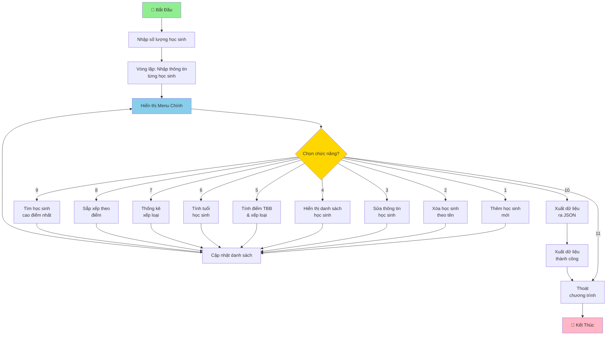

# Chương Trình Quản Lý Học Sinh Nhóm 5

## Mô Tả Chung

Chương trình quản lý học sinh là một ứng dụng dòng lệnh giúp quản lý thông tin học sinh, điểm số và xếp loại học tập. Chương trình hỗ trợ các thao tác CRUD cơ bản và cung cấp các chức năng phân tích dữ liệu học sinh toàn diện.

---

## Flowchart Chương Trình



---

## Tính Năng Chính

### 1. Thêm Học Sinh

Cho phép thêm một học sinh mới vào danh sách. Người dùng cần nhập:
- Họ và tên (chỉ nhận ký tự chữ)
- Giới tính (Nam hoặc Nữ)
- Ngày sinh (định dạng dd/mm/yyyy, năm từ 1926 đến 2026)
- Điểm các môn học cho HK1 và HK2 (các môn: Toán, Lý, Hóa, Anh, Sinh, Văn, Sử)

Tất cả dữ liệu đầu vào được kiểm tra tính hợp lệ trước khi lưu trữ.

### 2. Xóa Học Sinh

Xóa một học sinh khỏi danh sách dựa trên tên của họ. Chương trình sẽ tìm kiếm theo tên (không phân biệt hoa/thường) và xóa học sinh khỏi danh sách nếu tìm thấy.

### 3. Sửa Thông Tin Học Sinh

Cho phép cập nhật thông tin của một học sinh đã có:
- Sửa họ và tên
- Sửa giới tính
- Sửa ngày sinh
- Sửa điểm từng môn học cho cả HK1 và HK2

Người dùng có thể giữ nguyên bất kỳ thông tin nào bằng cách nhấn Enter mà không nhập dữ liệu.

### 4. Hiển Thị Danh Sách Học Sinh

Hiển thị toàn bộ danh sách học sinh dưới dạng bảng chi tiết với thông tin:
- Số thứ tự (STT)
- Họ tên
- Giới tính
- Ngày sinh
- Điểm trung bình HK1
- Điểm trung bình HK2
- Điểm trung bình cả năm (ĐTB CN)
- Xếp loại học sinh
- Tuổi (tính đến năm 2026)

### 5. Tính Điểm Trung Bình Và Xếp Loại

Tính toán và hiển thị kết quả học tập của tất cả học sinh:
- Điểm trung bình học kỳ 1 (HK1): tính dựa trên hệ số của từng môn
- Điểm trung bình học kỳ 2 (HK2): tính dựa trên hệ số của từng môn
- Điểm trung bình cả năm: công thức `(ĐTB HK1 + ĐTB HK2 × 2) / 3`
- Xếp loại học sinh

**Tiêu chí xếp loại dựa trên điểm trung bình cả năm:**
- **Giỏi:** Điểm ≥ 8.0
- **Khá:** Điểm 6.5 - 7.9
- **Trung bình:** Điểm 5.0 - 6.4
- **Yếu:** Điểm < 5.0

### 6. Tính Tuổi Học Sinh

Tính tuổi hiện tại của tất cả học sinh đến năm 2026 dựa trên ngày sinh. Hiển thị kết quả dưới dạng bảng với thông tin:
- Họ tên
- Ngày sinh
- Tuổi (tính theo năm)

### 7. Thống Kê Xếp Loại

Cung cấp thống kê số lượng học sinh theo từng xếp loại:
- Số học sinh Giỏi
- Số học sinh Khá
- Số học sinh Trung bình
- Số học sinh Yếu

Tính năng này giúp theo dõi chất lượng học tập chung của lớp/trường.

### 8. Sắp Xếp Học Sinh Theo Điểm

Sắp xếp danh sách học sinh theo điểm trung bình cả năm theo thứ tự giảm dần (cao đến thấp). Hiển thị bảng kết quả bao gồm:
- Số thứ tự (sau khi sắp xếp)
- Họ tên
- Điểm trung bình cả năm (ĐTB CN)
- Xếp loại

### 9. Tìm Học Sinh Cao Điểm Nhất

Tìm kiếm và hiển thị thông tin chi tiết của học sinh có điểm trung bình cả năm cao nhất:
- Họ tên
- Giới tính
- Ngày sinh
- Điểm trung bình cả năm
- Xếp loại

Tính năng này giúp xác định học sinh xuất sắc nhất.

### 10. Xuất Dữ Liệu Ra File JSON

Xuất toàn bộ danh sách học sinh và điểm số của họ ra file `data.json` để lưu trữ dữ liệu. File JSON chứa các thông tin:
- Họ và tên
- Giới tính
- Ngày sinh
- Tuổi
- Điểm trung bình kỳ 1
- Điểm trung bình kỳ 2
- Điểm trung bình cả năm
- Xếp loại

File được lưu ở định dạng JSON với encoding UTF-8 để hỗ trợ ký tự tiếng Việt.

---

## Hệ Thống Hệ Số Môn Học

Chương trình sử dụng hệ số khác nhau cho mỗi môn học để tính điểm trung bình:

| Môn Học | Hệ Số |
|---------|-------|
| Toán    | 2     |
| Lý      | 1     |
| Hóa     | 1     |
| Anh     | 1     |
| Sinh    | 1     |
| Văn     | 1     |
| Sử      | 1     |

Điểm trung bình là tổng của (điểm × hệ số) chia cho tổng hệ số.

---

## Yêu Cầu Đầu Vào & Xác Thực

Chương trình có các kiểm tra dữ liệu nhập vào:

- **Họ tên:** Chỉ chấp nhận ký tự chữ (không có số, ký tự đặc biệt)
- **Giới tính:** Phải là "Nam" hoặc "Nữ" (phân biệt hoa/thường)
- **Ngày sinh:** 
  - Định dạng: dd/mm/yyyy
  - Năm: từ 1926 đến 2026
  - Phải là ngày tháng năm hợp lệ
- **Điểm:** 
  - Phải là số thực (0-10)
  - Mỗi môn học có 2 điểm (HK1 và HK2)
  - Nhập lại nếu không hợp lệ

---

## Cách Sử Dụng

1. **Chạy chương trình:**
   ```bash
   python Nhom__.py
   ```

2. **Nhập số lượng học sinh ban đầu** khi được yêu cầu

3. **Nhập thông tin chi tiết** cho từng học sinh:
   - Họ và tên
   - Giới tính
   - Ngày sinh
   - Điểm từng môn HK1 và HK2

4. **Lựa chọn chức năng từ menu:**
   - Nhấn 1-9 để chọn chức năng quản lý
   - Nhấn 10 để xuất dữ liệu ra JSON rồi thoát
   - Nhấn 11 để thoát chương trình
   - Hoặc nhấn 10 rồi chọn 11 nếu muốn thoát mà không xuất

5. **Sau mỗi thao tác,** menu sẽ hiển thị lại để chọn tiếp

---

## Công Nghệ Sử Dụng

- **Ngôn ngữ:** Python 3.x
- **Thư viện chuẩn:**
  - `datetime` - Kiểm tra và xử lý ngày tháng
  - `json` - Xuất dữ liệu ra file JSON
- **Cấu trúc dữ liệu:** 
  - Danh sách (list) lưu trữ học sinh
  - Từ điển (dictionary) lưu trữ thông tin từng học sinh

---

## Lưu Ý Quan Trọng

- Chương trình lưu dữ liệu trong bộ nhớ RAM (tạm thời)
- Nếu muốn lưu dữ liệu lâu dài, hãy sử dụng **chức năng 10 - Xuất JSON**
- Tìm kiếm học sinh dựa vào tên không phân biệt chữ hoa/thường
- Tuổi được tính dựa trên năm 2026
- File `data.json` sẽ được tạo trong cùng thư mục với chương trình khi xuất dữ liệu
- Nên sao lưu file `data.json` định kỳ để không mất dữ liệu

---

## Contributors

- Đinh Đức Bình (Nhóm trưởng)
- Vũ Phạm Trường Anh (Vẽ Flowchart)
- Lê Tiến Dũng (Vẽ Flowchart, nhóm phó)
- Nguyễn Văn Dũng (Vẽ Flowchart)
- Trần Tiến Đạt (Tester)
- Bùi Xuân Hùng (Tester)
- Nguyễn Văn Hiếu (Coder)
- Nguyễn Tuấn Duy (Coder)
- Lê Ngọc Ánh (Tester)
- Nguyễn Hoàng Hải (Viết readme.md)
